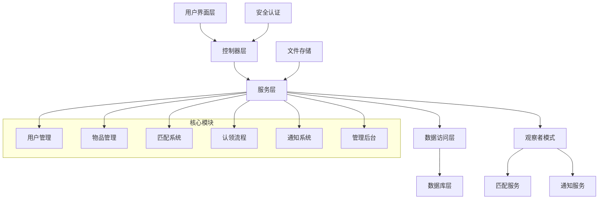

# 🎓 校园失物招领系统

<div align="center">


**一个基于Spring Boot的智能校园失物招领系统，采用观察者模式实现智能匹配功能**

[🚀 快速开始](#-快速开始) • [📖 功能特性](#-功能特性) • [🏗️ 技术架构](#️-技术架构) • [📱 界面预览](#-界面预览) • [👥 团队协作](#-团队协作)

</div>

---

## 📋 项目简介

校园失物招领系统是一个专为校园环境设计的失物招领平台，旨在帮助师生快速找回丢失的物品或归还拾到的物品。系统采用现代化的Web技术栈，提供直观易用的界面和智能的匹配算法。

### 🎯 核心价值

- **🔍 智能匹配**：基于观察者模式的智能匹配算法，自动匹配失物与拾获物品
- **👥 用户友好**：简洁直观的界面设计，支持移动端访问
- **🔒 安全可靠**：完善的用户认证和权限管理系统
- **📱 实时通知**：及时的消息推送和状态更新
- **🛡️ 管理完善**：全面的后台管理和数据统计功能

---

## ✨ 功能特性

### 🔐 用户管理
- **用户注册/登录**：支持邮箱注册，安全的密码验证
- **个人资料管理**：完善的头像上传和个人信息编辑
- **权限控制**：基于角色的访问控制（用户/管理员）

### 📦 物品管理
- **物品发布**：支持失物发布和拾获物品发布
- **图片上传**：多图片上传，支持预览和删除
- **分类管理**：详细的物品分类和位置信息
- **状态跟踪**：完整的物品状态生命周期管理

### 🔍 智能匹配
- **自动匹配**：基于观察者模式的智能匹配算法
- **多维度评分**：权重、地点、类别等多因素综合评分
- **匹配历史**：完整的匹配记录和历史查询
- **实时通知**：匹配成功时自动推送通知

### 💬 认领流程
- **认领申请**：详细的认领申请和验证信息
- **聊天系统**：失主与拾获者之间的实时沟通
- **审核流程**：管理员审核和用户确认双重验证
- **状态跟踪**：完整的认领状态跟踪

### 🔔 通知系统
- **实时通知**：系统消息实时推送
- **通知管理**：通知设置和历史记录
- **消息分类**：不同类型的通知分类管理

### 🛠️ 管理后台
- **数据统计**：全面的数据统计和分析
- **用户管理**：用户信息管理和权限控制
- **物品管理**：物品审核和状态管理
- **系统配置**：系统参数和配置管理

---

## 🏗️ 技术架构

### 🎨 前端技术
- **Thymeleaf**：服务端模板引擎
- **Bootstrap 5**：响应式UI框架
- **JavaScript**：前端交互逻辑
- **CSS3**：现代化样式设计

### ⚙️ 后端技术
- **Spring Boot 3.1.5**：主框架
- **Spring Security**：安全认证
- **Spring Data JPA**：数据持久化
- **H2 Database**：嵌入式数据库
- **Lombok**：代码简化

### 🎯 设计模式
- **观察者模式**：智能匹配功能实现
- **策略模式**：匹配评分算法
- **模板方法模式**：审核流程管理
- **依赖注入**：Spring框架依赖管理

### 📊 系统架构图



---

## 🚀 快速开始

### 📋 环境要求

- **Java 17+**
- **Maven 3.6+**
- **IDE**：推荐 IntelliJ IDEA 或 Eclipse

### 🔧 安装步骤

#### 1. 克隆项目
```bash
git clone https://github.com/your-username/campus-lost-found-system.git
cd campus-lost-found-system
```

#### 2. 配置数据库
系统使用H2嵌入式数据库，无需额外配置。数据库文件将自动创建在 `data/` 目录下。

#### 3. 运行项目
```bash
# 使用Maven运行
mvn spring-boot:run

# 或者先编译再运行
mvn clean package
java -jar target/campus-lost-found-system-1.0.0.jar
```

#### 4. 访问系统
- **应用地址**：http://localhost:8081/campus-lost-found
- **H2控制台**：http://localhost:8081/campus-lost-found/h2-console
  - JDBC URL: `jdbc:h2:file:./data/lostfounddb`
  - 用户名: `sa`
  - 密码: (空)

### 👤 默认账户

系统启动后会自动创建以下测试账户：

| 角色 | 用户名 | 密码 | 说明 |
|------|--------|------|------|
| 管理员 | admin | admin123 | 系统管理员账户 |
| 普通用户 | user1 | user123 | 测试用户账户 |
| 普通用户 | user2 | user123 | 测试用户账户 |

---

## 📱 界面预览

### 🏠 首页
- 最新发布的失物和拾获物品展示
- 快速搜索和筛选功能
- 系统公告和帮助信息

### 📝 物品发布
- 直观的物品信息填写界面
- 多图片上传和预览功能
- 详细的位置和分类选择

### 🔍 智能匹配
- 自动匹配结果展示
- 匹配评分和详细信息
- 一键联系功能

### 💬 聊天系统
- 实时消息交流
- 文件传输支持
- 消息历史记录

### 🛠️ 管理后台
- 数据统计仪表板
- 用户和物品管理
- 系统配置和监控

---

## 👥 团队协作

### 🎯 项目分工

| 成员 | 负责模块 | 主要功能 |
|------|----------|----------|
| **张三** | 用户管理 + 系统架构 | 用户认证、权限控制、系统架构设计 |
| **李四** | 物品发布模块 | 物品发布、图片上传、分类管理 |
| **王五** | 搜索匹配模块 | 智能匹配算法、搜索功能 |
| **赵六** | 认领流程模块 | 认领申请、聊天系统、审核流程 |
| **钱七** | 通知系统模块 | 消息推送、通知管理、举报功能 |
| **孙八** | 管理后台模块 | 数据统计、用户管理、系统配置 |

### 🌿 分支策略

- **main**：主分支，存放稳定可发布的代码
- **develop**：开发分支，集成所有功能开发
- **feature/***：功能分支，按开发者姓名和功能命名
- **hotfix/***：修复分支，用于紧急问题修复

### 📋 开发规范

- **代码提交**：使用规范的提交信息格式
- **代码审查**：所有代码必须经过审查才能合并
- **测试要求**：新功能必须包含相应的测试用例
- **文档更新**：功能变更需要同步更新文档

---

## 📊 项目统计

<div align="center">

| 指标 | 数量 |
|------|------|
| 📁 总文件数 | 80+ |
| 💻 代码行数 | 5000+ |
| 🎨 模板文件 | 30+ |
| 🏗️ 实体类 | 13+ |
| 🎮 控制器 | 12+ |
| ⚙️ 服务类 | 8+ |

</div>

---

## 🛠️ 开发工具

### 推荐IDE配置
- **IntelliJ IDEA**：推荐使用，支持Spring Boot开发
- **插件推荐**：
  - Lombok Plugin
  - Spring Boot Helper
  - Thymeleaf Plugin

### 数据库工具
- **H2 Console**：内置Web控制台
- **DBeaver**：通用数据库管理工具

### 版本控制
- **Git**：版本控制
- **GitHub Desktop**：图形化Git客户端

---

## 📚 相关文档

- [📖 系统设计文档](校园失物招领系统匹配机制设计分析文档.md)
- [👥 团队协作指南](项目分工和分支策略.md)
- [🚀 快速上手指南](快速上手指南.md)
- [🧪 测试计划](校园失物招领系统角色测试计划.md)

---

## 🤝 贡献指南

我们欢迎所有形式的贡献！请遵循以下步骤：

1. **Fork** 本仓库
2. 创建您的特性分支 (`git checkout -b feature/AmazingFeature`)
3. 提交您的更改 (`git commit -m 'Add some AmazingFeature'`)
4. 推送到分支 (`git push origin feature/AmazingFeature`)
5. 打开一个 **Pull Request**

### 📝 提交规范

我们使用 [Conventional Commits](https://www.conventionalcommits.org/) 规范：

- `feat:` 新功能
- `fix:` 修复bug
- `docs:` 文档更新
- `style:` 代码格式调整
- `refactor:` 代码重构
- `test:` 测试相关
- `chore:` 构建过程或辅助工具的变动

---

## 📄 许可证

本项目采用 MIT 许可证 - 查看 [LICENSE](LICENSE) 文件了解详情。

---

## 🙏 致谢

感谢所有为这个项目做出贡献的团队成员：

- **张三** - 系统架构师
- **李四** - 前端开发工程师
- **王五** - 算法工程师
- **赵六** - 后端开发工程师
- **钱七** - 测试工程师
- **孙八** - 运维工程师

---

## 📞 联系我们

- **项目地址**：[GitHub Repository](https://github.com/your-username/campus-lost-found-system)
- **问题反馈**：[Issues](https://github.com/your-username/campus-lost-found-system/issues)
- **邮箱联系**：campus-lost-found@example.com

---

<div align="center">

**⭐ 如果这个项目对您有帮助，请给我们一个Star！**

Made with ❤️ by Campus Lost & Found Team

</div>
